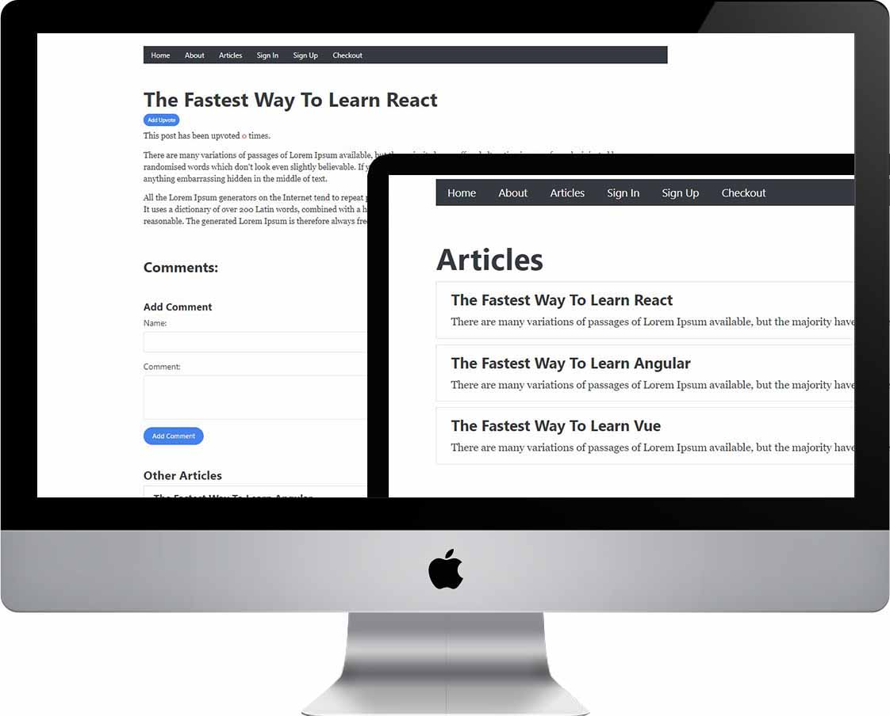

## A Blog Project | React / Node.js / MongoDb

Learning to full stack interactive web application by React, Node.js and MongoDb database.

### Learning Objectives

- Creating the app component
- Using React-Router links
- Setting up an Express server
- Route parameters in Express
- Adding the comments functionality
- Installing and adding MongoDB to your project
- Rewriting the endpoints
- Adding React hooks
- Adding buttons and forms
- Sign In and Sign Up page.
- Pushing code to GitHub
